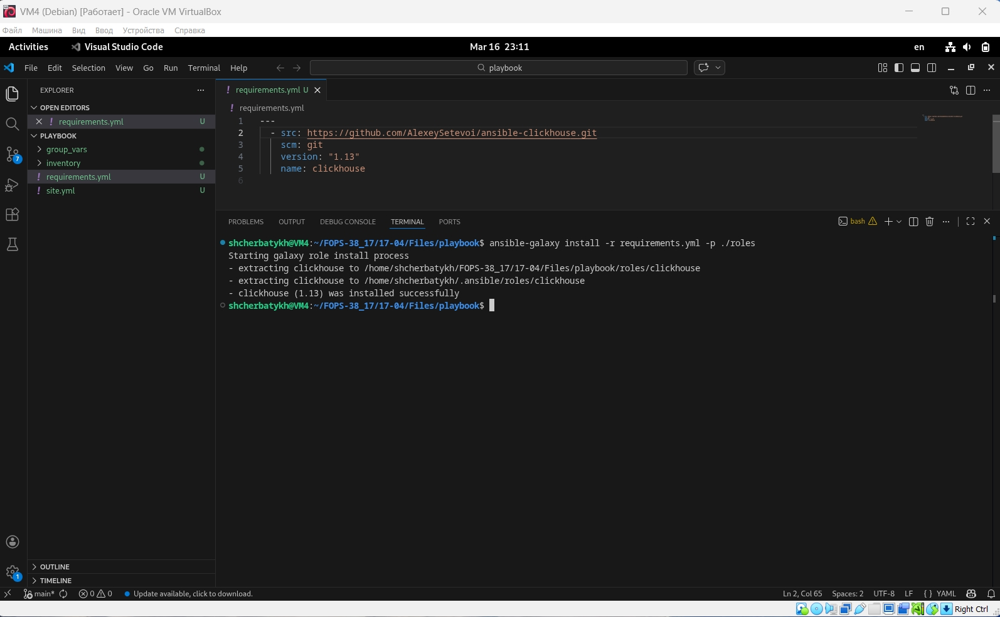
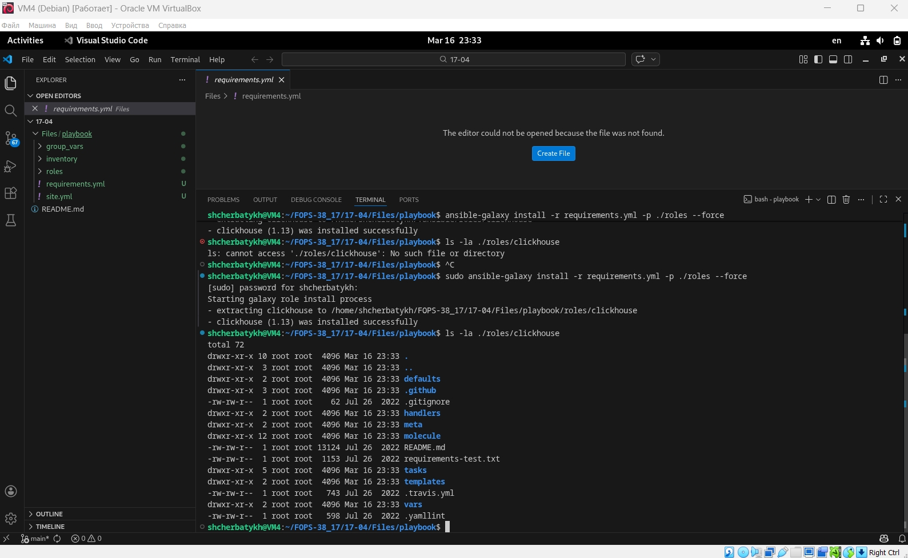
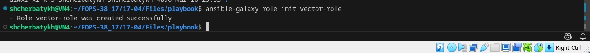
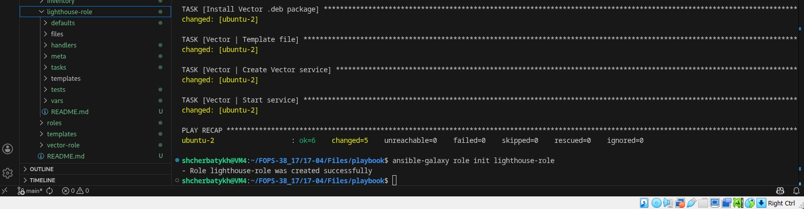
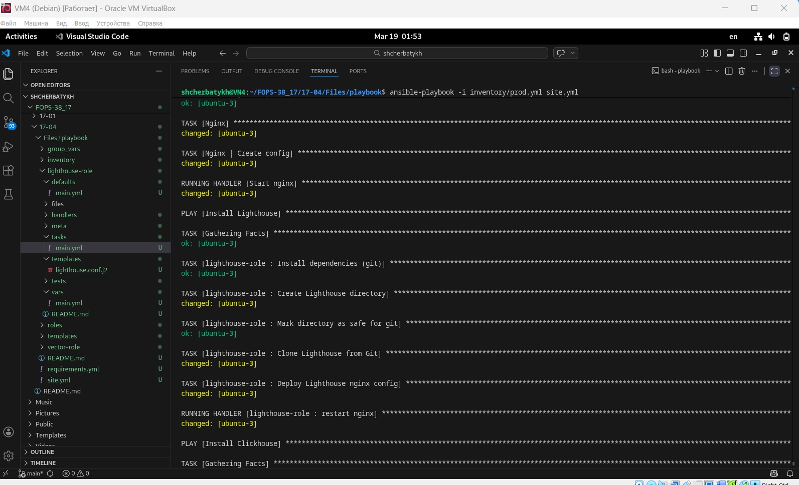

## Домашнее задание к занятию «Работа с roles» FOPS-38 (Щербатых А.Е.)

### Основная часть
---
Ваша цель — разбить ваш playbook на отдельные roles.

Задача — сделать roles для ClickHouse, Vector и LightHouse и написать playbook для использования этих ролей.

Ожидаемый результат — существуют три ваших репозитория: два с roles и один с playbook.

Что нужно сделать

1. Создайте в старой версии playbook файл ```requirements.yml``` и заполните его содержимым:

```bash
---
  - src: git@github.com:AlexeySetevoi/ansible-clickhouse.git
    scm: git
    version: "1.13"
    name: clickhouse
``` 
2. При помощи ```ansible-galaxy``` скачайте себе эту роль.

3. Создайте новый каталог с ролью при помощи ```ansible-galaxy role init vector-role```.

4. На основе tasks из старого playbook заполните новую role. Разнесите переменные между ```vars``` и ```default```.

5. Перенести нужные шаблоны конфигов в ```templates```.

6. Опишите в ```README.md``` обе роли и их параметры. Пример качественной документации ansible role по ссылке.

7. Повторите шаги 3–6 для LightHouse. Помните, что одна роль должна настраивать один продукт.

8. Выложите все roles в репозитории. Проставьте теги, используя семантическую нумерацию. Добавьте roles в ```requirements.yml``` в playbook.

9. Переработайте playbook на использование roles. Не забудьте про зависимости LightHouse и возможности совмещения ```roles``` с ```tasks```.

10. Выложите playbook в репозиторий.

11. В ответе дайте ссылки на оба репозитория с roles и одну ссылку на репозиторий с playbook.

---

### Решение основной части

1. В старом playbook создал файл requirements.yml с указанным содержимым:

 

2. Скачал роль с помощью ansible-galaxy, появилась директория roles с субдиректорией clickhouse, в которой находится playbook для установки роли clickhouse.



3. С помощью ansible-galaxy role init vector-role создал роль vector-role



4. Проверил работу playbook после изменения на основании roles (vector-role)


5. Повторил все шаги для роли lighthouse-role



и также проверил работу playbook после изменения на основании roles (lighthouse-role)



6. Выложил роли в репозитории. Ссылки на репозитории ролей:

[Vector-role](https://github.com/Anton-Shcherbatykh/FOPS-38_17/tree/main/17-04/Files/playbook/vector-role)

[Lighthouse-role](https://github.com/Anton-Shcherbatykh/FOPS-38_17/tree/main/17-04/Files/playbook/lighthouse-role)

7.Выложил playbook в репозиторий. Ссылка на playbook:

[Playbook](https://github.com/Anton-Shcherbatykh/FOPS-38_17/tree/main/17-04/Files/playbook)

