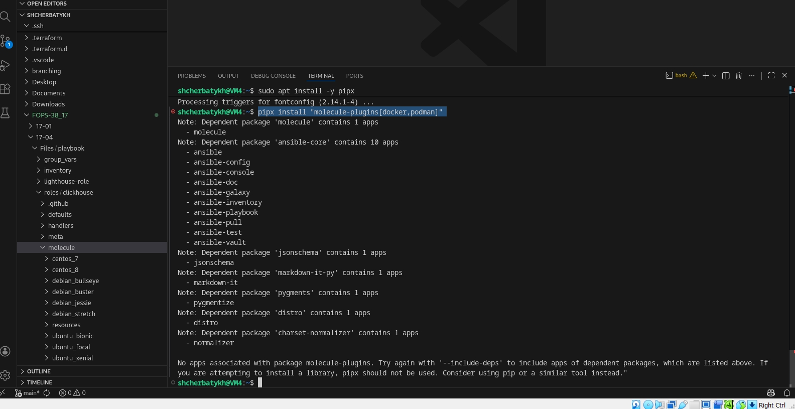
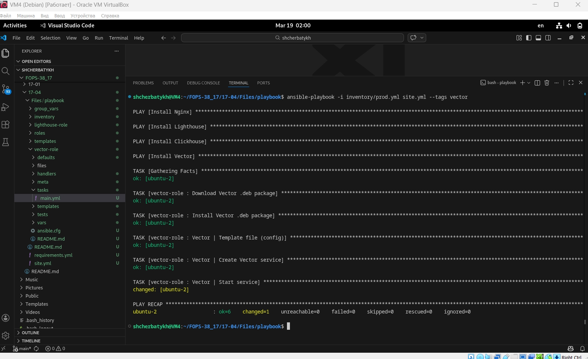
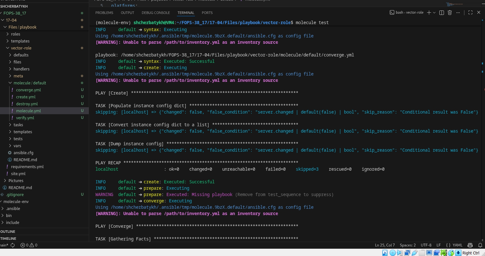
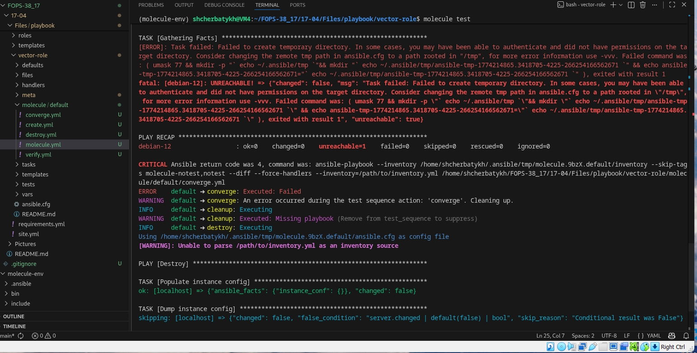
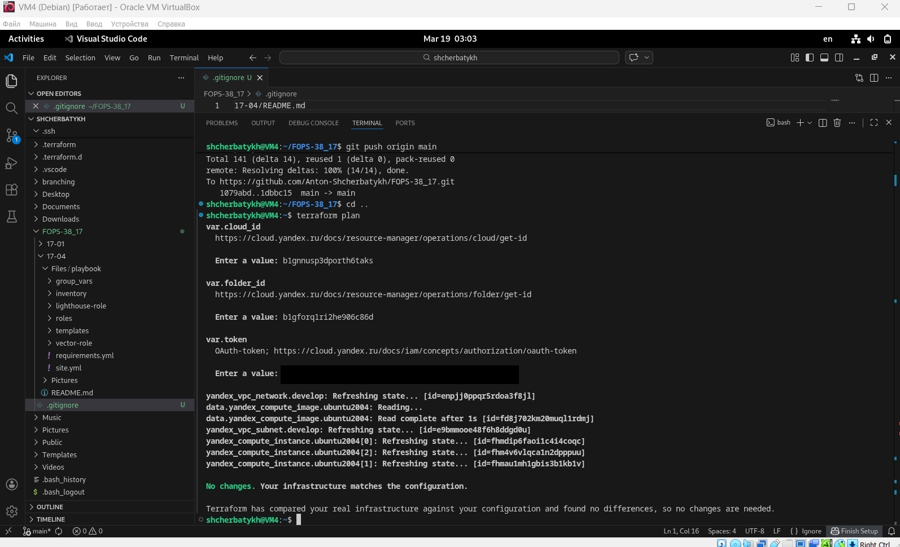
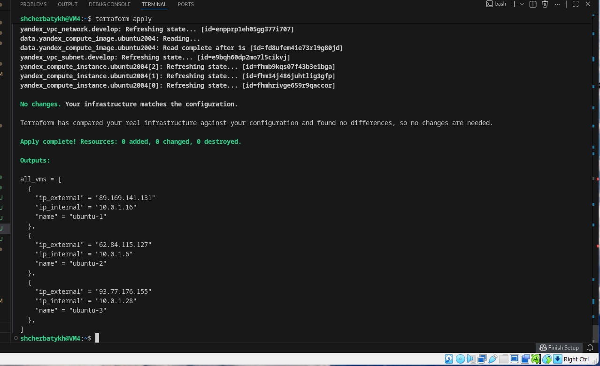
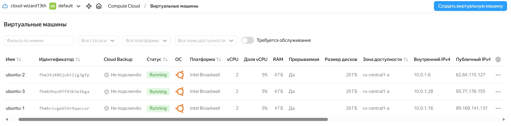
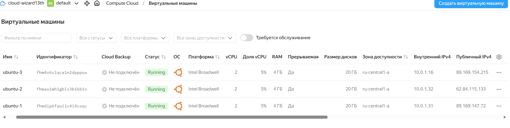
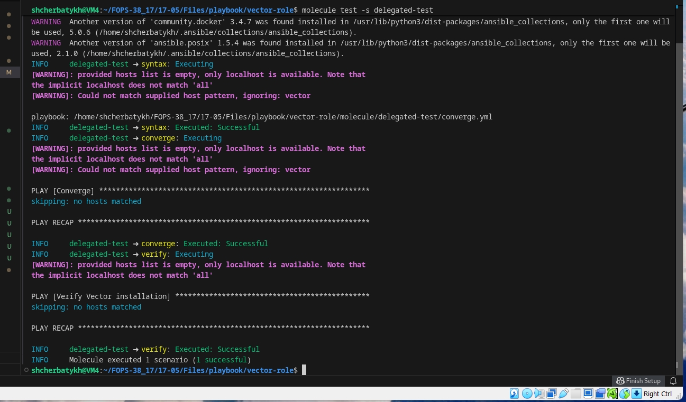

## Домашнее задание к занятию «Тестирование roles» FOPS-38 (Щербатых А.Е.)

### Основная часть
---
Ваша цель — настроить тестирование ваших ролей.

Задача — сделать сценарии тестирования для vector.

Ожидаемый результат — все сценарии успешно проходят тестирование ролей.

### Molecule
1. Запустите ```molecule test -s ubuntu_xenial``` (или с любым другим сценарием, не имеет значения) внутри корневой директории ```clickhouse-role```, посмотрите на вывод команды. Данная команда может отработать с ошибками или не отработать вовсе, это нормально. Наша цель - посмотреть как другие в реальном мире используют молекулу И из чего может состоять сценарий тестирования.
2. Перейдите в каталог с ролью ```vector-role``` и создайте сценарий тестирования по умолчанию при помощи ```molecule init scenario --driver-name docker```.
3. Добавьте несколько разных дистрибутивов (oraclelinux:8, ubuntu:latest) для инстансов и протестируйте роль, исправьте найденные ошибки, если они есть.
4. Добавьте несколько assert в verify.yml-файл для проверки работоспособности vector-role (проверка, что конфиг валидный, проверка успешности запуска и др.).
5. Запустите тестирование роли повторно и проверьте, что оно прошло успешно.
6. Добавьте новый тег на коммит с рабочим сценарием в соответствии с семантическим версионированием.

### Выполнение
1. Т.к. использую ВМ на ОС Debian 12, то установку плагинов для molecule выолнял через pipx, а не через pip3.
2. Для начала установил сам pipx с помощью команды sudo apt install -y pipx. Затем выполнил команду для установки плагинов pipx install "molecule-plugins[docker,podman]"



3. Создал и активировал виртуальное окружение:


4. Команда molecule init scenario в версии 26.3.0 не принимает аргументы --driver-name или --driver. 
Эти опции были удалены в пользу настройки драйвера непосредственно в файле конфигурации. Чтобы создать сценарий с драйвером Docker, выполняю следующее:
- Создаю сценарий по умолчанию (сначала создал default, но потом всё снёс и стал пеерделывать на другом)

```bash
cd /home/shcherbatykh/FOPS-38_17/17-04/Files/playbook/vector-role
molecule init scenario homework1705
```


5. Попробовал протестировать роль с использованием **molecule** но из-за проблем при создании папки внутри контейнера тестирование закончилось неудачно









Решил попробовать применить **molecule** с "живыми" ВМ.

С помощью terraform создал ВМ в облаке





Создал новый сценарий

```bash
cd /home/shcherbatykh/FOPS-38_17/17-04/Files/playbook/vector-role
molecule init scenario delegated-test
```



Настроил```molecule/delegated-test/molecule.yml```. Отредактировал файл, указав путь к существующему инвентарю и отключив создание/удаление контейнеров.

```bash
---
driver:
  name: default

provisioner:
  name: ansible
  roles_path:
    - /home/shcherbatykh/FOPS-38_17/17-05/Files/playbook/vector-role
  playbooks:
    converge: converge.yml
    verify: verify.yml
  ansible_cfg:
    defaults:
      host_key_checking: false
      inventory: /home/shcherbatykh/FOPS-38_17/17-05/Files/playbook/inventory/prod.yml

verifier:
  name: ansible

scenario:
  name: delegated-test
  test_sequence:
    - syntax
    - converge
    - verify
```
Настроил converge.yml, применив роль к хостам группы vector (как в основном плейбуке).

```bash
---
- name: Converge
  hosts: vector
  become: true
  tasks:
    - name: Apply vector-role
      ansible.builtin.include_role:
        name: vector-role
```

выполнил ```molecule test -s delegated-test``` и получил, что ```molecule converge``` не находит хосты, хотя инвентарь корректный и Ansible его видит (проверено через ansible-inventory). Судя по всему, это происходит потому, что ```molecule``` для сценария с драйвером ```default``` по умолчанию создаёт свой собственный инвентарь и не использует указанный в ```inventory_path```. Я много раз пробовал разные варианты, но проблема не решается.



Все файлы по выполняемому заданию вот тут [Vector-role](https://github.com/Anton-Shcherbatykh/FOPS-38_17/tree/main/17-05/Files/playbook/vector-role)
