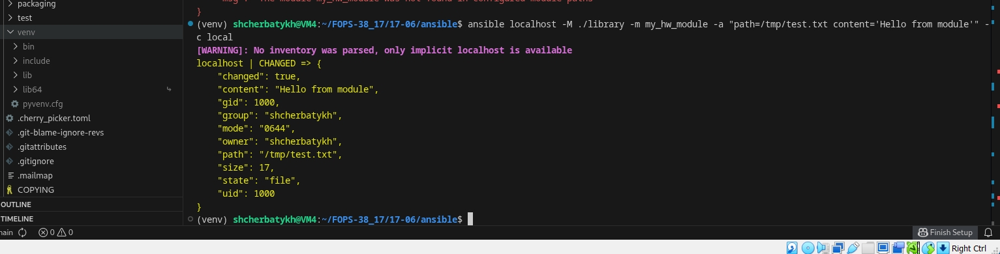
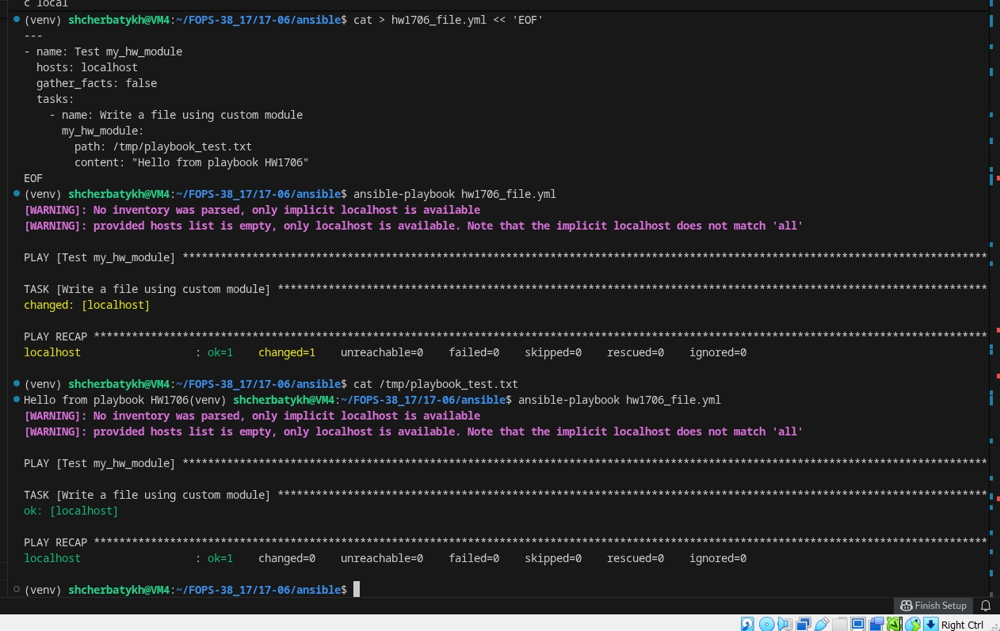
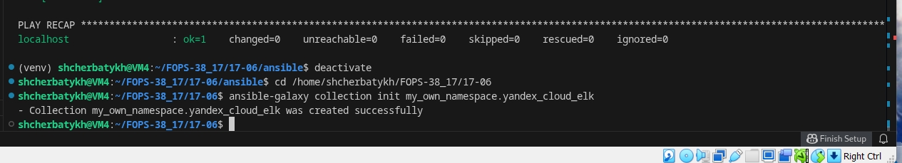
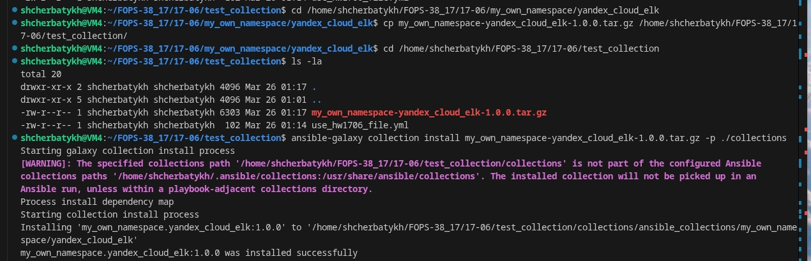
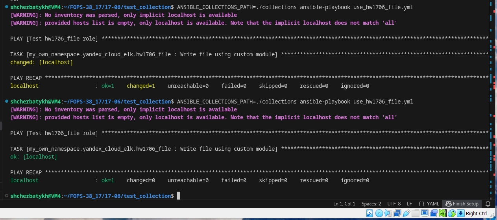

## Домашнее задание к занятию «Создание собственных модулей» - Щербатых А.Е. (FOPS-38)

### Основная часть
---
Наша цель — написать собственный module, который я смогу использовать в своей role через playbook. Всё это должно быть собрано в виде collection и отправлено в мой репозиторий.

Шаг 1. В виртуальном окружении создайте новый my_***_module.py файл

Шаг 2. Наполните его содержимым из [статьи](https://docs.ansible.com/projects/ansible/latest/dev_guide/developing_modules_general.html#creating-a-module)

Шаг 3. Заполните файл в соответствии с требованиями Ansible так, чтобы он выполнял основную задачу: module должен создавать текстовый файл на удалённом хосте по пути, определённом в параметре path, с содержимым, определённым в параметре content.

Шаг 4. Проверьте module на исполняемость локально.

Шаг 5. Напишите single task playbook и используйте module в нём.

Шаг 6. Проверьте через playbook на идемпотентность.

Шаг 7. Выйдите из виртуального окружения.

Шаг 8. Инициализируйте новую collection: ansible-galaxy collection init my_own_namespace.yandex_cloud_elk.

Шаг 9. В эту collection перенесите свой module в соответствующую директорию.

Шаг 10. Single task playbook преобразуйте в single task role и перенесите в collection. У role должны быть default всех параметров module.

Шаг 11. Создайте playbook для использования этой role.

Шаг 12. Заполните всю документацию по collection, выложите в свой репозиторий, поставьте тег 1.0.0 на этот коммит.

Шаг 13. Создайте .tar.gz этой collection: ansible-galaxy collection build в корневой директории collection.

Шаг 14. Создайте ещё одну директорию любого наименования, перенесите туда single task playbook и архив c collection.

Шаг 15. Установите collection из локального архива: ansible-galaxy collection install <archivename>.tar.gz.

Шаг 16. Запустите playbook, убедитесь, что он работает.

Шаг 17. В ответ необходимо прислать ссылки на collection и tar.gz архив, а также скриншоты выполнения пунктов 4, 6, 15 и 16.

---

### Выполнение

1. Создал пустой публичный репозиторий в своём проекте [FOPS38_17](https://github.com/Anton-Shcherbatykh/FOPS-38_17)
2. Скачал репозиторий Ansible: ```https://github.com/ansible/ansible.git``` в созданный репозиторий.
3. Создал виртуальное окружение: ```python3 -m venv venv```. Активировал его командой: ```. venv/bin/activate```. Дальнейшие действия производил только в виртуальном окружении.
4. Установил зависимости ```pip install -r requirements.txt```.
5. Произвёл настройку окружения командой: ```. hacking/env-setup```.
6. В виртуальном окружении создал ```my_hw_module.py``` файл.
7. Наполните его содержимым из [статьи](https://docs.ansible.com/projects/ansible/latest/dev_guide/developing_modules_general.html#creating-a-module)
8. Заполнил файл в соответствии с требованиями Ansible, чтобы он выполнял основную задачу: ```module``` должен создавать текстовый файл на удалённом хосте по пути, определённом в параметре ```path```, с содержимым, определённым в параметре ```content```.
9. Проверил ```module``` на исполняемость локально.



10. Написал single task playbook и использовал module в нём.

11. Проверил ```module``` через playbook на идемпотентность.



12. Вышел из виртуального окружения.
13. Инициализировал новую collection: ansible-galaxy collection init my_own_namespace.yandex_cloud_elk.



14. В эту collection перенёс свой ```module``` в соответствующую директорию.
15. Single task playbook преобразовал в single task role и перенёс в collection. У role есть default всех параметров ```module```.
16. Создал playbook для использования этой role.
17. Заполнил документацию по collection, выложил в свой репозиторий, поставил тег 1.0.0 на этот коммит.
18. Создал .tar.gz этой collection командой ```ansible-galaxy collection build``` в корневой директории collection.
19. Создал ещё одну директорию, перенёс туда ```single task playbook``` и архив c collection.
20. Установил collection из локального архива командой ```ansible-galaxy collection install my_own_namespace-yandex_cloud_elk-1.0.0.tar.gz```.



22. Запустил playbook и убедился, что он работает.




